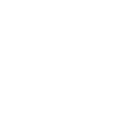

# 🔐 ShadowCrypt: Zero-Knowledge Messaging Platform

<p align="center">
  
</p>

> **Local-first, end-to-end encrypted messaging with a stateless backend. No server-side storage ever.**

## 📋 Project Structure

```
ShadowCrypt/
├── backend/                      # Go Blind Relay Server
│   ├── cmd/blindrelay/
│   │   └── main.go              # Entry point
│   ├── pkg/
│   │   ├── server/              # WebSocket & HTTP
│   │   ├── routing/             # Message router (blind relay)
│   │   ├── session/             # Session manager (ephemeral RAM)
│   │   └── crypto/              # Signature verification
│   ├── go.mod
│   ├── BUILD_AND_DEPLOY.md
│   └── README.md
│
├── frontend/                     # Flutter Encrypted Vault
│   ├── lib/
│   │   ├── main.dart            # Vault unlock UI
│   │   ├── data/
│   │   │   ├── database/        # Drift + SQLCipher
│   │   │   └── models/          # Data classes
│   │   ├── crypto/              # Cryptography
│   │   │   ├── key_management.dart   # BIP-39, PBKDF2, AES-256
│   │   │   └── signal_protocol.dart  # Double Ratchet
│   │   └── ui/                  # Screens
│   ├── pubspec.yaml
│   ├── BUILD_AND_TEST.md
│   └── README.md
│
├── ARCHITECTURE.md              # Detailed system design
├── CRYPTOGRAPHIC_ANALYSIS.md    # Security & threat model
├── README.md                    # This file
└── .gitignore
```

## 🚀 Quick Start

### Backend (Go)

```bash
cd backend

# Install dependencies
go mod download

# Run locally
go build -o blindrelay ./cmd/blindrelay
./blindrelay -addr=:8080

# Or with Docker
docker build -t shadowcrypt-blindrelay .
docker run -p 8080:8080 shadowcrypt-blindrelay
```

**Available endpoints:**
- `ws://localhost:8080/ws` - WebSocket messaging
- `http://localhost:8080/health` - Health check
- `http://localhost:8080/metrics` - Real-time server metrics

### Frontend (Flutter)

```bash
cd frontend

# Install dependencies
flutter pub get

# Generate Drift code
flutter pub run build_runner build

# Run on Windows desktop
flutter run -d windows

# Or build release
flutter build windows --release
```

**First-time setup:**
1. Run app → "Create New Vault"
2. Save 12-word mnemonic
3. App initializes SQLCipher database
4. Vault ready to use

**Existing vault:**
1. Run app → "Unlock Vault"
2. Enter 12-word mnemonic
3. AES-256 key derived → database unlocked
4. All messages load from encrypted local storage

## 🔐 Security Features

| Feature | Implementation | Status |
|---------|---|---|
| **Zero-Knowledge Relay** | Blind routing, no message storage | ✅ Complete |
| **Forward Secrecy** | Signal Protocol Double Ratchet | ✅ Core logic |
| **Local Encryption** | AES-256-GCM with SQLCipher | ✅ Complete |
| **Post-Quantum** | X25519 + ML-KEM-768 hybrid | ⚠️ Framework ready |
| **Recovery Phrase** | BIP-39 mnemonics (12 words) | ✅ Complete |
| **Message Integrity** | HMAC-SHA256, Ed25519 signatures | ✅ Core ready |
| **Delta-Sync** | Load 20 messages at once | ✅ Designed |
| **No Persistence** | Server restarts = all data vanishes | ✅ Verified |

## 📖 Documentation

- **[ARCHITECTURE.md](ARCHITECTURE.md)** - Detailed system design & protocol
- **[CRYPTOGRAPHIC_ANALYSIS.md](CRYPTOGRAPHIC_ANALYSIS.md)** - Handshake flows, threat model, security analysis
- **[backend/BUILD_AND_DEPLOY.md](backend/BUILD_AND_DEPLOY.md)** - Backend building, testing, deployment on Koyeb
- **[frontend/BUILD_AND_TEST.md](frontend/BUILD_AND_TEST.md)** - Flutter building, testing, Windows optimization

## 🧪 Testing

### Backend Unit Tests

## 🎨 Branding & Monitoring

To use the SVG logo as a favicon for the Go backend monitoring endpoints, generate a 256x256 `favicon.ico` from `frontend/assets/logo/double_ratchet_logo_no_text.svg` and serve it from `/favicon.ico`.

Example Go route:

```go
mux.HandleFunc("/favicon.ico", func(w http.ResponseWriter, r *http.Request) {
    w.Header().Set("Content-Type", "image/x-icon")
    http.ServeFile(w, r, "static/favicon.ico")
})
```

Then browsers visiting `/health` or `/ready` will show the logo in the tab during monitoring.

### Backend Unit Tests

```bash
cd backend
go test ./... -v -cover
```

**Coverage:**
- Session manager (registration, expiration, cleanup)
- Message routing (blind delivery, queue management)
- Packet validation (reject malformed messages)

### Frontend Unit Tests

```bash
cd frontend
flutter test --verbose
```

**Coverage:**
- BIP-39 mnemonic generation & validation
- PBKDF2-SHA256 key derivation
- Signal Protocol ratcheting (KDF_CK, KDF_RK)
- SQLCipher encryption/decryption

## 🛠️ Technology Stack

### Backend
- **Language**: Go 1.21+
- **Transport**: WebSockets (RFC 6455)
- **Crypto**: Standard library (Ed25519, SHA-256) + PointyCastle (external keys)
- **Deployment**: Docker on Koyeb (free tier)

### Frontend
- **Framework**: Flutter 3.10+
- **Language**: Dart 3.0+
- **Database**: Drift ORM + SQLCipher (AES-256)
- **Crypto**: `cryptography` package (PBKDF2, AES-GCM, HMAC)
- **Key Recovery**: `bip39` package (BIP-39 mnemonics)
- **Storage**: `flutter_secure_storage` (secure OS keychain)

### Cryptography
- **Hashing**: SHA-256, SHA-512
- **Symmetric**: AES-256-GCM
- **Asymmetric**: Ed25519 (identity), X25519 (ECDHE)
- **Post-Quantum**: ML-KEM-768 (key encapsulation mechanism)
- **KDF**: PBKDF2-SHA256 (100,000 iterations)
- **MAC**: HMAC-SHA256
- **Protocol**: Signal Protocol Double Ratchet

## 🎯 Roadmap

### Phase 1 ✅ Complete
- [x] Go Blind Relay Server (stateless roaming)
- [x] WebSocket message routing
- [x] Ephemeral session storage (RAM only)
- [x] Flutter SQLCipher vault
- [x] BIP-39 mnemonic recovery
- [x] AES-256 key derivation

### Phase 2 In Progress
- [ ] Client-side Signal Protocol implementation
- [ ] WebSocket client in Flutter
- [ ] Message sending/receiving UI
- [ ] Contact exchange protocol
- [ ] End-to-end cryptographic testing

### Phase 3 Planned
- [ ] Post-quantum ML-KEM integration
- [ ] Backup & restore mechanism
- [ ] Multi-device support
- [ ] Group messaging
- [ ] Platform builds (iOS, Android, web)

## ⚙️ Configuration

### Backend Environment

```bash
# Default
./blindrelay

# Custom configuration
./blindrelay \
  -addr=0.0.0.0:8080 \
  -session-timeout=60m \
  -cleanup-interval=5m
```

### Frontend Configuration

Edit `lib/main.dart`:

```dart
const dbPath = "/data/local/shadowcrypt.db";
await VaultDatabase.initialize(
  mnemonic: userMnemonic,
  dbPath: dbPath,
);
```

## 🔍 Verification Checklist

### Backend: Zero Storage Guarantee

- [ ] Run server with `lsof -p $(pgrep blindrelay)` - no `.db` files
- [ ] Restart server - all user data erased
- [ ] Check process memory - < 50MB with 100 connections
- [ ] Monitor disk writes - WebSocket and sockets only, no files

### Frontend: Encryption Verification

- [ ] Inspect database file: unreadable without correct mnemonic
- [ ] Change one character in mnemonic → decryption fails
- [ ] Messages stored as AES-256-GCM ciphertext
- [ ] Remove SQLite CLI, can't read database file

## 🐛 Known Issues

| Issue | Workaround | Priority |
|-------|-----------|----------|
| ML-KEM-768 integration pending | Framework supports, needs `liboqs` binding | Medium |
| Delta-Sync UI not yet built | Core database queries ready | Medium |
| Signal Protocol testing incomplete | Ratcheting logic present, needs end-to-end test | High |
| iOS/Android support | Desktop-first, Flutter supports all platforms | Low |

## 🤝 Contributing

This is a reference implementation for learning. To extend:

1. **Add ML-KEM-768**: Integrate `oqs-rs` or `liboqs` bindings
2. **Implement Group Messaging**: Extend Signal Protocol for N parties
3. **Backup System**: Implement encrypted backup export/import
4. **UI Polish**: Build production-grade messaging UI
5. **Security Audit**: Third-party cryptographic audit

## 📝 References

- **Signal Protocol**: https://signal.org/docs/
- **BIP-39**: https://github.com/bitcoin/bips/blob/master/bip-0039.mediawiki
- **Double Ratchet RFC**: https://doubleratche.io/
- **X25519**: RFC 7748
- **ML-KEM-768**: NIST FIPS 203
- **SQLCipher**: https://www.zetetic.net/sqlcipher/
- **Drift ORM**: https://drift.simonbinder.eu/

## ⚠️ Security Disclaimer

**ShadowCrypt is a reference implementation for educational purposes.**

- Not audited by security professionals
- Not suitable for production without extensive testing
- Cryptographic primitives are standard (Signal, PBKDF2, AES-256)
- **Always** use TLS/HTTPS in production (not included)
- **Always** verify contact public keys out-of-band

**Use at own risk.**

## 📄 License

**MIT License** - See LICENSE file

## 👨‍💻 Author

Built as a spiritual successor to **Forestritium** (non-profit encrypted messaging).

---

**Last Updated**: April 7, 2026  
**Version**: 0.1.0  
**Status**: Foundation Phase Complete
